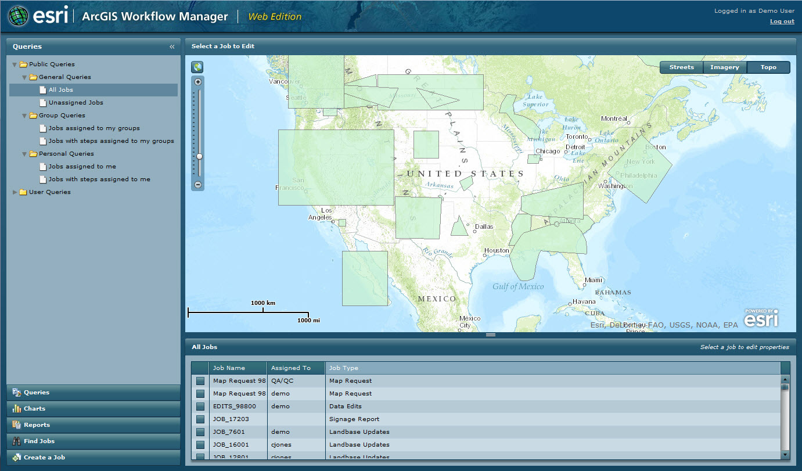

# workflowmanager-viewer-flex
ArcGIS Workflow Manager Flex viewer - Manage your workflows on the web. 

## Features
* Ready-to-deploy Workflow Manager GIS web client for ArcGIS Server
* A complete workflow management application, that allows for ease and efficiency toward managing and tracking business workflows.
* Easily configurable to meet custom business needs and requirements - no programming skills required to deploy.
* Source code available for Flex developers that want to customize the web application.

## Support
[Flex 3.x versions of Web API and Viewers were retired](https://support.esri.com/en/Products/More-Products/legacy-products/arcgis-api-for-flex/3-x#product-support) on June 1, 2016.  This retirement includes the Workflow Manager Flex Viewer.

We recommend you upgrade to the [Workflow Manager JavaScript Viewer](https://github.com/esri/workflowmanager-viewer-js).

## Instructions

Deployment:

1. Fork and then clone the repo.
2. Install an HTTP server such IIS or Apache.
3. Deploy the contents of the [dist](dist) directory to your HTTP server.  
Refer to the [dist\README_FlexViewer.pdf](dist/README_FlexViewer.pdf) file for deployment and configuration information.
4. If using IIS, create a website.
5. Launch the sample viewer in a web browser.

## Requirements

* HTTP server such IIS or Apache
* Web browser with access to the Internet

## Resources

* [ArcGIS Workflow Manager Resource Center](https://resources.arcgis.com/en/communities/workflow-manager/)

## Issues

Find a bug or want to request a new feature?  Please let us know by submitting an issue.

## Contributing

Esri welcomes contributions from anyone and everyone. Please see our [guidelines for contributing](https://github.com/esri/contributing).

## Licensing
Copyright 2015 Esri

Licensed under the Apache License, Version 2.0 (the "License");
you may not use this file except in compliance with the License.
You may obtain a copy of the License at

   http://www.apache.org/licenses/LICENSE-2.0

Unless required by applicable law or agreed to in writing, software
distributed under the License is distributed on an "AS IS" BASIS,
WITHOUT WARRANTIES OR CONDITIONS OF ANY KIND, either express or implied.
See the License for the specific language governing permissions and
limitations under the License.

A copy of the license is available in the repository's [LICENSE.txt](LICENSE.txt) file.

####Open Source Acknowledgements

Acknowledgments for the third‐parties whose software has been used in
permissible forms with ESRI products can be found at 
[ArcGIS Workflow Manager - Web Viewer Acknowlegements.pdf](dist/ArcGIS Workflow Manager - Web Viewer Acknowlegements.pdf).
